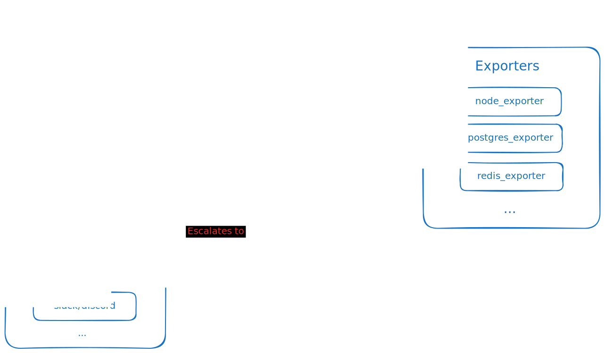

import Admonition from "../../components/Admonition.astro";

# Table of Contents 

For alerting in Python Discord and other personal projects I am a big fan of AlertManager. Unlike other much more complex alerting and on-call systems, AlertManager is a dead-simple Go application which is easy to deploy and configured solely with YAML files.

AlertManager is the alerting offering as part of the Prometheus suite of utilities. It serves as a daemon which receives firing alerts from Promethues and pushes them to configured notification channels based on label matching (i.e. for severity).

An overview of how AlertManager fits into a hypothetical monitoring stack is shown below:



The process of alerting looks something like this:
- Prometheus scrapes metrics from our services or exporters
- Prometheus evaluates alerting rules and fires alerts to AlertManager
- AlertManager decides which alerts to send to which notification channels based on configured routing rules
- Notification channels (e.g. Slack, PagerDuty) receive the alerts and notify the relevant people

At every step of this there are many configuration options available but this summarises a general installation and usage of AlertManager.

# Why High Availability, and what does it look like?

In any production system, high availability is important for most critical components, and the alerting stack is definitely one of those.

If AlertManager goes down, we lose the ability to alert and notify team members if any of our software goes down, a problem with AlertManager compromises all other running software, highly-available or not.

AlertManager fortunately has a solution for this in it's high availability mode.

In this mode, AlertManager uses a gossip protocol backed by [Memberlist](https://github.com/hashicorp/memberlist) (a HashiCorp project) to synchronise multiple instances of AlertManager, all of which are capable of sending alerts and have the same configuration.

If one AlertManager instance receives an alert it is replicated across all other instances, and if one instance goes down, the others can continue to send alerts. Later I will show the Prometheus config needed to ensure that a downed AlertManager instance does not compromise the ability to send alerts.

# The Kubernetes Situation

Kubernetes is renowned for it's ability to run services that scale and are highly available, but it is not without it's own challenges.

AlertManager high availability is configured using the `--cluster.peer` flag, which you pass multiple times for each AlertManager instance.

This is fine for an AlertManager deployment on a known set of machines where static IPs can be allocated, but in Kubernetes, pods are ephemeral and can be rescheduled at any time, resulting in a shift in IP addresses.

There are a few problems that arise immediately because of this:
- Peers passed in the `--cluster.peer` flag are static, if the peer restarts and gets a new IP, the old instances will continue to try to connect to the old IP
- If a peer goes down, the other peers will not be able to connect to it's new IP, as once the flags are set, they are not updated

By default, AlertManager will try to reconnect to peers for 6 hours, that means that if there is no manual intervention then most deployments would report an unhealthy state for 6 hours after a peer goes down.

This is managable, but there are many situations where you want to alert on the status of your alerting system (who watches the watchmen?).

# The Solution

<Admonition level="warning" title="A prefacing note">
Whilst this solution works for me and my projects, there are likely downsides of this.

The solution of rebooting a single AlertManager instance is still not perfect, and to reboot and ensure peering is correct it's still necessary to reboot all deployed instances.

This solution simply makes the process of peers discovering each other easier (due to dynamic network addresses) and ensures that peers only try to connect to others in it's same deployment hash.
</Admonition>

My solution here is the use of an init container on AlertManager pods which does the following:
- Determines the current AlertManager deployment hash
- Query the Kubernetes API (exposed to all pods) for all pods in the same namespace with the same deployment hash
- Takes the IP from each pod located
- Writes out a file of `--cluster.peer` flags to be passed to AlertManager

<Admonition level="note" title="What are pod template hashes?">
Kubernetes deployments operate by creating a "template" of a pod. It defines things like the container image, environment variables, volume mounts and more.

Pods in a deployment are identified by a hash of this template, and if the template changes, the pod is recreated with a new hash.

Let's look at pods in the `monitoring` namespace:

```bash
$ kubectl get pods -n monitoring
NAME                                  READY   STATUS    RESTARTS   AGE
alertmanager-64bff65b74-bcjts         1/1     Running   0          42m
alertmanager-64bff65b74-njd7x         1/1     Running   0          42m
alertmanager-64bff65b74-t97sb         1/1     Running   0          42m
```
<br/>

Here, the deployment name is `alertmanager`, and the hash is `64bff65b74`. After the template hash there is a unique pod identifier which is not relevant to this discussion.

The Kubernetes object these hashes correspond to is a `ReplicaSet`, but that also doesn't really matter to us today.
</Admonition>

This init script for us is a Bash script that is mounted as a ConfigMap and run as an init container:

```bash
#!/bin/sh

# Install curl and jq for JSON parsing
apk add curl jq

# Find the template hash
echo Finding template hash...
TEMPLATE_HASH=$(echo $HOSTNAME | cut -d- -f2)

# Query kubernetes API for all matching pods
echo Querying Kubernetes API for pods...
PODS=$(curl \
    -H "Authorization: Bearer $(cat /var/run/secrets/kubernetes.io/serviceaccount/token)" \
    https://kubernetes.default/api/v1/namespaces/monitoring/pods\?labelSelector=pod-template-hash=$TEMPLATE_HASH\&pretty=false -sk -o /tmp/peers.json)

echo Finding Alertmanager IPs...
AM_IPS=$(jq '.items[].status.podIP' /tmp/peers.json -r)

echo Generating CLI flags for Alertmanager...
PEER_ARGS=$(echo $AM_IPS | sed 's/ /\n/g' | awk '{ print "--cluster.peer="$1":9094" }')

echo Writing CLI flags to /tmp/peers...
echo $PEER_ARGS > /tmp/peers
```

As you can see the endpoint that makes it all work is the `/api/v1/namespaces/monitoring/pods` endpoint, which returns all pods in the `monitoring` namespace.

We filter by the `pod-template-hash` attribute, which is a label attached to all pods containing the hash component we discussed earlier.

```bash
$ kubectl get pods -n monitoring -o custom-columns=NAME:.metadata.name,Hash:.metadata.labels.pod-template-hash,IP:.status.podIP
NAME                                  Hash         IP
alertmanager-64bff65b74-bcjts         64bff65b74   10.2.0.218
alertmanager-64bff65b74-njd7x         64bff65b74   10.2.1.55
alertmanager-64bff65b74-t97sb         64bff65b74   10.2.0.122
grafana-795b86f6b6-ppgfj              795b86f6b6   10.2.1.51
kube-state-metrics-577f77b9f5-dzh8g   577f77b9f5   10.2.0.72
```

Once this init container is run, we are left with a file that can be mounted to the regular container and interpolated into the arguments passed to AlertManager.

<Admonition level="note" title="How do gradual restarts affect this?">
If using rolling update features of Kubernetes you will likely experience some odd behaviour with this setup.

When the first pod of a ReplicaSet boots and the init container runs, it will have no peers to connect to.

As more pods boot, they will locate the existing instances and begin the peering.

Once a cluster link has been established then the communication is bidirectional, that is to say that it doesn't matter that the first instance to reboot has no peers and the last one has all of them, they will all eventually find each other.
</Admonition>

# Putting it together

Once this script is in a ConfigMap, it can be mounted to the AlertManager pod as an init container:

```yaml title="alertmanager-deployment.yaml" {12-30}
apiVersion: apps/v1
kind: Deployment
metadata:
  name: alertmanager
  namespace: monitoring
spec:
  template:
    spec:
      serviceAccountName: alertmanager
      containers:
        # Your AlertManager container here
      initContainers:
        - image: alpine:latest
          imagePullPolicy: Always
          name: alertmanager-peering-setup
          command: [
            '/opt/pydis/alertmanager/init.d/find-pods.sh'
          ]
          volumeMounts:
            - name: alertmanager-init
              mountPath: /opt/pydis/alertmanager/init.d
            - name: alertmanager-tmp
              mountPath: /tmp
      volumes:
        - name: alertmanager-init
          configMap:
            name: alertmanager-init
              defaultMode: 0777
        - name: alertmanager-tmp
          emptyDir: {}
```

<Admonition level="warning" title="Omissions from snippets">
Both the above snippet and below snippets will have omissions for brevity, they are not valid Kubernetes deployments alone.

I recommend you browse the full deployment file we have in our repository (linked at the end of this article) for a full view of the deployment.
</Admonition>

I've taken the variable names as is from the Python Discord configuration, it assumes you have stored the script in a ConfigMap named `alertmanager-init` in a key called `find-pods.sh`. You can tweak these as desired.

We define another volume called `alertmanager-tmp` which is an emptyDir volume, this is used to store the output of the script.

Now we have a deployment that will populate the `/tmp/peers` file, we just need to plug this file into the AlertManager container.

```yaml title="alertmanager-deployment.yaml"
apiVersion: apps/v1
kind: Deployment
metadata:
  name: alertmanager
  namespace: monitoring
spec:
  replicas: 3
  template:
    spec:
      serviceAccountName: alertmanager
      containers:
      - image: prom/alertmanager:latest
        imagePullPolicy: Always
        name: alertmanager
        command:
          - /bin/sh
          - -c
          - |
            exec /bin/alertmanager \
              --config.file=/opt/pydis/alertmanager/config.d/alertmanager.yaml \
              --web.external-url=https://alertmanager.pydis.wtf \
              --storage.path=/data/alertmanager \
              $(cat /tmp/peers)
        ports:
        - name: am
          containerPort: 9093
        - name: am-peering
          containerPort: 9094
        volumeMounts:
        - name: alertmanager-config
          mountPath: /opt/pydis/alertmanager/config.d
        - name: alertmanager-tmp
          mountPath: /tmp
        securityContext:
          readOnlyRootFilesystem: true
```

You can see how we mount the `/tmp/peers` folder into the AlertManager container and interpolate it into the command.

We have to use `sh` to run this as interpolation into arguments like this is a shell feature.

HA AlertManager requires port 9094 to be accessible by your clusters network policies in addition to the regular AlertManager port 9093.

For Python Discord, we opt for 3 replicas (as we have 3 nodes) but you can adjust this as needed.

## Service Account

For this to work, the service account for the AlertManager pod needs to have the correct permissions to query the Kubernetes API.

That looks something like this:

```yaml title="alertmanager-serviceaccount.yaml"
---
kind: ClusterRole
apiVersion: rbac.authorization.k8s.io/v1
metadata:
  name: alertmanager
rules:
- apiGroups: [""]
  resources: ["pods", "endpoints"]
  verbs: ["get", "list"]
---
apiVersion: v1
kind: ServiceAccount
metadata:
  name: alertmanager
  namespace: monitoring
---
apiVersion: rbac.authorization.k8s.io/v1
kind: ClusterRoleBinding
metadata:
  name: alertmanager
roleRef:
  apiGroup: rbac.authorization.k8s.io
  kind: ClusterRole
  name: alertmanager
subjects:
  - kind: ServiceAccount
    name: alertmanager
    namespace: monitoring
```

## Bonus: Distribution across nodes

If you are running AlertManager on a multi-node cluster, you may want to ensure that each AlertManager instance is running on a different node.

This ensures that:
- If a node can't reach the AlertManager, it can try another one
- In the event of a internode network failure, you can guarantee to have a local AlertManager instance on the node

Normally, to achieve this sort of distribution you might opt to use a `DaemonSet`, but I opted to use a `Deployment` as the backing `ReplicaSet` are much easier to work with in the peering discovery script.

However, even with a `Deployment` it's still very possible to distribute the pods across nodes using a pod anti-affinity rules.

These rules define certain conditions that the pod scheduler aims to adhere to when deciding which node a requested pod should be allocated onto.

In theory, you can pick a whole handful of node labels or other items to use in selectors here to granularly control your pod scheduling, but for this we only need to look at the node hostname.

```yaml title="alertmanager-deployment.yaml"
apiVersion: apps/v1
kind: Deployment
metadata:
  name: alertmanager
  namespace: monitoring
spec:
  replicas: 3
  template:
    spec:
      serviceAccountName: prometheus
      affinity:
        podAntiAffinity:
          preferredDuringSchedulingIgnoredDuringExecution:
          - podAffinityTerm:
              labelSelector:
                matchExpressions:
                - key: app
                  operator: In
                  values:
                  - alertmanager
              namespaces:
              - monitoring
              topologyKey: kubernetes.io/hostname
            weight: 100
```

This anti-affinity rule will ensure that no two AlertManager pods with the label `app=alertmanager` are placed on the same node.

## All together now

Once this is all put together, you should have a highly available AlertManager deployment that can recover from node failures and network partitions.

You should be able to create a service and the necessary ingresses and reach the AlertManager HTTP frontend on port 9093.


If all is correct, you should see all your peers reporting as healthy.

# Prometheus Integration

Of course, you could have the greatest AlertManager deployment in the world, but if Prometheus doesn't know about it, or tries to access it incorrectly, then all your hard work on high availability is for naught.

The important thing is as follows: **Do not load balance AlertManager instances**.

If you have load balancing and an instance goes down, Prometheus is not aware, will either continue to try to send to the downed instance or will decide there are no instances to send to.

Instead, Prometheus should be configured to send to all instances. The AlertManager gossip protocol handles deduplication and ensures that there is a settling period before alerts are distributed to prevent any double notification.

In Kubernetes, we can use a `ClusterIP` service to automatically expose all AlertManager instances to Prometheus. The Prometheus `dns_sd_configs` lookup will expand the DNS records generated by this service and send to all of them.

First, define the service like following:

```yaml title="alertmanager-service.yaml"
apiVersion: v1
kind: Service
metadata:
  name: alertmanager-sd
  namespace: monitoring
spec:
  selector:
    app: alertmanager
  clusterIP: None
  ports:
  - port: 9093
    targetPort: 9093
    name: am
  - port: 9094
    targetPort: 9094
    name: am-peering
```

Next, you can configure Prometheus to use this service in the `alerting` section of the configuration:

```yaml title="prometheus-config.yaml"
alerting:
  alertmanagers:
    - scheme: http
      dns_sd_configs:
        - names:
          - alertmanager-sd.monitoring.svc.cluster.local
          type: A
          port: 9093
```

Once a Prometheus alert is triggered, you should hopefully see it appear in the AlertManager UI and be distributed to the configured notification channels.

# Examples

You can find a full example of our AlertManager and Prometheus configuration in the [python-discord/infra](https://github.com/python-discord/infra) repository on GitHub.

- [Prometheus](https://github.com/python-discord/infra/tree/main/kubernetes/namespaces/monitoring/prometheus)
- [AlertManager](https://github.com/python-discord/infra/tree/main/kubernetes/namespaces/monitoring/alerts/alertmanager)
- [AlertManager config](https://github.com/python-discord/infra/blob/main/kubernetes/namespaces/monitoring/alerts/alertmanager.yaml)

# Conclusion

High availability is a critical part of any production system, and the alerting stack is no exception.

AlertManager is a great solution to alerting for small-to-medium sized projects, hopefully as you can see it's not too difficult to make it highly available as well.

If you have any questions or comments, feel free to reach out to me over email at [joe@jb3.dev](mailto:joe@jb3.dev) or on Twitter at [@JoeBanksDev](https://twitter.com/JoeBanksDev).
