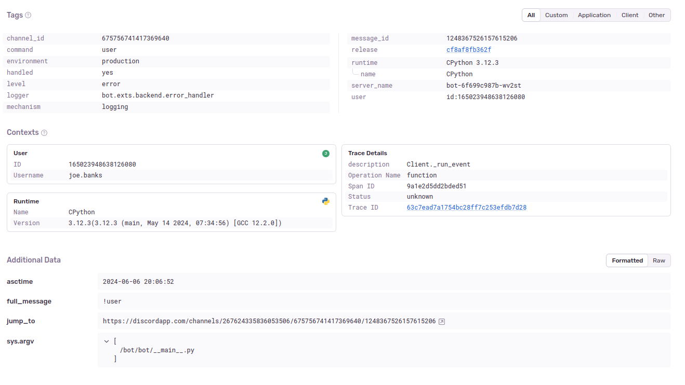

import Admonition from "../../components/Admonition.astro";

# Contents

# Introduction

We have several tools setup to assist with the collection of statistics within Python Discord. We use these statistics to audit several things within the guild, such as help channel capacity, errors within our services and redundant channels.

This article talks about several of the tools we use and problems we overcame while building this system.

<Admonition level="note" title="Database naming">
Throughout this series, I refer to analytics databases as "statistics" databases and call data that is otherwise used for server functionality "business" data. This is to differentiate between the two types of data we collect and analyse.

In reality, we are a non-profit Discord community and there is not much "business", but the delineation is drawn to separate the two types of data we collect and analyse.
</Admonition>

# What comes under our statistics system?

We have several different types of statistics we collect within Python Discord. These include:
- Data from the Discord server, such as message counts, channel counts and user counts.
- Data from our in-house services, like our site and Discord bot, such as error rates and response times.
- Data from external products that we host, such as PostgreSQL and Redis, which capture things like query times and cache hit rates.

The nature of each of these statistics is different. Some are better suited as row-based data, while others are better suited as time-series data. We use different tools to collect and store these statistics based on their nature. As a community with cost constraints, we have to efficiently collect, store and query this data.

In this initial article, I'm just going to cover services that we run explicitly for the purpose of collecting statistics. In future articles, I'll cover how other business services have their data analysed alongside our statistics to derive insights about the community.

# Tools we use

## Discord Data

### Quick & Dirty Analytics: StatsD & Graphite

We have some quick fire-and-forget style analytics pushers in our Discord Bot that create gauges and counters for things like command invocations, usage of bot functionality (e.g. which packages are used with our `!doc` command). These metrics are great because they're easy to implement and don't require much overhead. Our bot has an in-built statistics client that sends these metrics to a Graphite instance.

This data is time-series data and is stored in Graphite.

You can see an example of a gauge we have [here](https://github.com/python-discord/bot/blob/17c08e08b89bf83a62542300df779a6324df6389/bot/exts/help_channels/_stats.py#L24):

```py title="bot/exts/help_channels/_stats.py" {4}
def report_post_count() -> None:
    """Report post count stats of the help forum."""
    help_forum = bot.instance.get_channel(constants.Channels.python_help)
    bot.instance.stats.gauge("help.total.in_use", len(help_forum.threads))
```

This is all the code necessary to create and ship off a metric to our Graphite instance.

Under the hood, we use StatsD to collect these metrics and Graphite to store them. Our bots are configured with a statsd client which is namedspaced. We collect roughly 130k of these metric payloads per day from varying areas of our bot. We use a UDP transport for this data, which is fire-and-forget, meaning we don't have to wait for a response from the server.

Pros:
- Easy to implement
- Low overhead
- Great for time-series data and quick queries

Cons:
- Inaccuracy and lack of granularity limits the usefulness of this data for some use cases
- By design, just numbers, meaning we can't store complex data structures

You can find Graphite on GitHub [here](https://github.com/graphite-project), and StatsD [here](https://github.com/stats/statsd)

### Detailed Collection: Metricity

For more detailed statistics, we use a service called Metricity. We built Metricity to collect more detailed statistics about our Discord server and store them into PostgreSQL. Metricity runs as a Discord bot and collects everything it sees in a privacy-friendly way.

As an example, whilst our Graphite instance can tell us how many messages are sent in a channel, Metricity can tell us who sent those messages and when. This is useful for auditing purposes and for understanding how our community interacts.

An important part of Metricity is that it is privacy-friendly. We don't store any message content, only metadata about the message. This is important to us as we want to ensure that our users' privacy is respected.

Our Metricity tables look something like this:

```sql title="metricity.sql"
CREATE TABLE public.messages (
    id character varying NOT NULL,
    channel_id character varying NOT NULL,
    author_id character varying NOT NULL,
    created_at timestamp without time zone,
    is_deleted boolean NOT NULL,
    thread_id character varying
);

CREATE TABLE public.users (
    id character varying NOT NULL,
    name character varying NOT NULL,
    avatar_hash character varying,
    joined_at timestamp without time zone NOT NULL,
    created_at timestamp without time zone NOT NULL,
    is_staff boolean NOT NULL,
    bot boolean NOT NULL,
    in_guild boolean NOT NULL,
    public_flags json,
    pending boolean NOT NULL,
    guild_avatar_hash character varying
);
```

All-in-all, this is not a lot of data (and intentionally so). We only store what we need to store to provide the statistics we need. We have a few other tables for things like channel and thread metadata, but the idea is the same.

<Admonition level="note" title="ID datatypes">
You will notice from the tables above that we use `character varying` for IDs. This is because Discord IDs are 64-bit integers.

Whilst PostgreSQL does have a `bigint` type and Python also handles variably sized integers, some of our analytics tools do not support this.

As an example, [metabase/metabase#5816](https://github.com/metabase/metabase/issues/5816) has been open for almost 7 years with no fix.

Our business side databases use `bigint` for IDs, which does limit some functionality in Metabase but is a tradeoff we have made.
</Admonition>

When a message is sent, Metricity picks it up and stores it in the database, in a row like this:

```sh
metricity=# SELECT * FROM messages WHERE id='1187478121885225090';
         id          |     channel_id     |     author_id      |       created_at        | is_deleted | thread_id
---------------------+--------------------+--------------------+-------------------------+------------+-----------
 1187478121885225090 | 464905259261755392 | 165023948638126080 | 2023-12-21 19:34:06.534 | f          |
(1 row)
```

In later articles, I'll discuss what types of insights we can pick off from this data.

Metricity is an open-source project that you can run on your Discord community, you can find it [here](https://github.com/python-discord/metricity).

## In-House Services

### Error Collection: Sentry

We use Sentry to collect errors from our in-house services. Sentry is a great tool for collecting errors and exceptions from your applications. We use it to collect errors from our site and our Discord bot.

For Discord data, it captures exception information, and we attach a selection of additional context to the error, such as the message that caused the error and the user who caused it.

For our site, in addition to capturing error data, Sentry captures performance data, such as response times and request counts. It automatically provides notifications for regressions in performance, which is useful for us to keep an eye on.

You can see how we attach additional context to an error in our bot [here](https://github.com/python-discord/bot/blob/17c08e08b89bf83a62542300df779a6324df6389/bot/exts/backend/error_handler.py#L403):

```py title="bot/exts/backend/error_handler.py"
with new_scope() as scope:
    scope.user = {
        "id": ctx.author.id,
        "username": str(ctx.author)
    }

    scope.set_tag("command", ctx.command.qualified_name)
    scope.set_tag("message_id", ctx.message.id)
    scope.set_tag("channel_id", ctx.channel.id)

    scope.set_extra("full_message", ctx.message.content)

    if ctx.guild is not None:
        scope.set_extra(
            "jump_to",
            f"https://discordapp.com/channels/{ctx.guild.id}/{ctx.channel.id}/{ctx.message.id}"
        )

    log.error(f"Error executing command invoked by {ctx.message.author}: {ctx.message.content}", exc_info=e)
```

When the error reaches Sentry, all this additional context is attached to the error, which is useful for debugging:



Sentry is a paid service, but Python Discord is fortunate enough to have received a sponsorship and discounted business plan from Sentry. You can find Sentry [here](https://sentry.io).

### Django Performance: django-prometheus

We use `django-prometheus` to collect performance metrics from our Django site.

Metrics collected include (amongst others):
- Request counts
- Response times
- Error rates
- Database query times

This is exposed in our Django application at the `/metrics` path (which is obviously disabled externally).

As an example of some of the metrics we collect, you can see the following:

```sh
root@debian-shell:/# curl http://site.web.svc.cluster.local/metrics
# HELP django_http_requests_total_by_method_total Count of requests by method.
# TYPE django_http_requests_total_by_method_total counter
django_http_requests_total_by_method_total{method="GET"} 13109.0
django_http_requests_total_by_method_total{method="POST"} 304.0
django_http_requests_total_by_method_total{method="PUT"} 222.0
django_http_requests_total_by_method_total{method="PATCH"} 363.0
django_http_requests_total_by_method_total{method="DELETE"} 2.0
# HELP django_db_new_connections_total Counter of created connections by database and by vendor.
# TYPE django_db_new_connections_total counter
django_db_new_connections_total{alias="default",vendor="postgresql"} 2255.0
django_db_new_connections_total{alias="metricity",vendor="postgresql"} 28.0
# HELP django_db_execute_total Counter of executed statements by database and by vendor, including bulk executions.
# TYPE django_db_execute_total counter
django_db_execute_total{alias="default",vendor="postgresql"} 19943.0
django_db_execute_total{alias="metricity",vendor="postgresql"} 108.0
```

The great thing about `django-prometheus` is that it is a drop-in solution for Django applications.

You can find our PRs to implement it to our site here:
- [Add Django Prometheus (PR #575)](https://github.com/python-discord/site/pull/575)
- [Use Django Prometheus Database Adapters (PR #1333)](https://github.com/python-discord/site/pull/1333)

Once implemented, your application will start exposing metrics at the `/metrics` endpoint.

<Admonition level="warning" title="Exposing metrics publicly">
By default, `django-prometheus` exposes metrics publicly. This is not a major security risk and not a lot of the data is sensitive, but you should be aware of what you are exposing.

We disable public access to the `/metrics` endpoint in our Kubernetes cluster by using an Ingress annotation:

```yaml {6-10}
metadata:
  annotations:
    nginx.ingress.kubernetes.io/auth-tls-verify-client: "on"
    nginx.ingress.kubernetes.io/auth-tls-secret: "kube-system/mtls-client-crt-bundle"
    nginx.ingress.kubernetes.io/auth-tls-error-page: "https://www.youtube.com/watch?v=dQw4w9WgXcQ"
    nginx.ingress.kubernetes.io/server-snippet: |
      location ~* /metrics {
        deny all;
        return 403;
      }
```
</Admonition>

You can find `django-prometheus` [here](https://github.com/korfuri/django-prometheus).

### Future Plans

I'm looking into various tracing solutions to get an even more granular overview of our services.

Hopefully, with this we can trace a request entering our system, through our services and back out again. I'm looking for a solution that can help us debug where in the chain a request is failing/where a bottleneck is occurring.

## Third Party Services

We also run a selection of external services within our infrastructure, either on Kubernetes or in our Ansible-managed machines. We need to have metrics collected from these services too, and hooking them into our existing alerting pipelines is hugely helpful.

All other metrics generally go into Prometheus as they are time-series related and are used for alerting.

A summary of these is as follows:
- We use `cadvisor` to collect container metrics for our Kubernetes cluster.
- We use `node_exporter` to collect machine metrics for our Kubernetes cluster.
- We use `postgres_exporter` to collect metrics from our PostgreSQL databases.
- We use `redis_exporter` to collect metrics from our Redis instances.

In additional, other services we run already expose a metrics endpoint we can hook onto, such as:
- `cert-manager` (allowing us to alert on failed TLS certificate renewal)
- `kube-state-metrics` (allowing us to alert on failed deployments)
- `ingress-nginx` (allowing us to alert on failed Ingresses and high error rates)
- `coredns` (allowing us to alert on high DNS query failures)

Alerting is covered in a future article, but using the above we are able to alert on everything from one of our volumes filling up, to high error rates on one of our HTTP services, to our log ingestion backing up, all in one pipeline and place.

# Collection Agents

## Prometheus

We use Prometheus to collect metrics from our services. Prometheus is a time-series database with a pull structure that periodically scrapes a set of endpoints for metrics.

Since we run in Kubernetes, we use Kubernetes service discovery to find our services. This means that we don't have to manually configure Prometheus to scrape our services, it picks them up automatically based on pod/service annotations.

As an example, here is the service manifest for our site service, you can see the `prometheus.io` annotations which enable scraping for this service:

```yaml {6-8}
apiVersion: v1
kind: Service
metadata:
  name: site
  namespace: web
  annotations:
    prometheus.io/scrape: "true"
    prometheus.io/port: "8000"
spec:
  selector:
    app: site
  ports:
    - protocol: TCP
      port: 80
      targetPort: 8000
```

Prometheus then discovers this service and scrapes the `/metrics` endpoint on port 8000 for each pod with the matching selector:


For our baremetal services, we have Ansible template a Prometheus configuration that targets the defined exporters we have. All our critical database infrastructure runs on baremetal machines which run `postgres_exporter` and `node_exporter`.

We have Prometheus configured to retain 100 days of data, or 28GiB, whichever comes first. At time of writing, we have 93,994 series in our Prometheus database. We are scraping around 35 targets, a mix of our own services and open-source software we run in our cluster.

You can find Prometheus [here](https://prometheus.io/).

# Conclusion

Hopefully this article gives you some insight into the tools we use to collect statistics within Python Discord.

In future articles, I'll cover how we use this data to make decisions about the community and how we use it to improve our services, and how we alert on our service data.

I'll also cover our seperate but similar logging infrastructure that collects logs from all our services, including our baremetal machines, and how we use this data to debug issues and improve our services.
