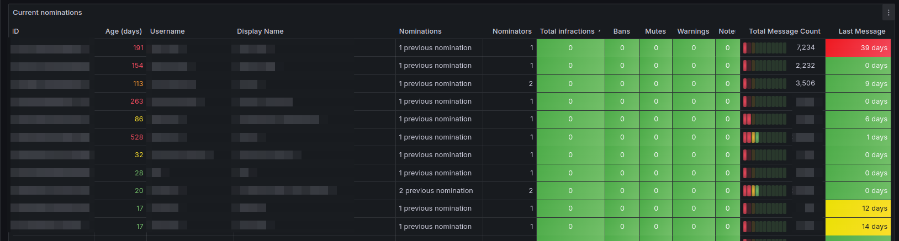
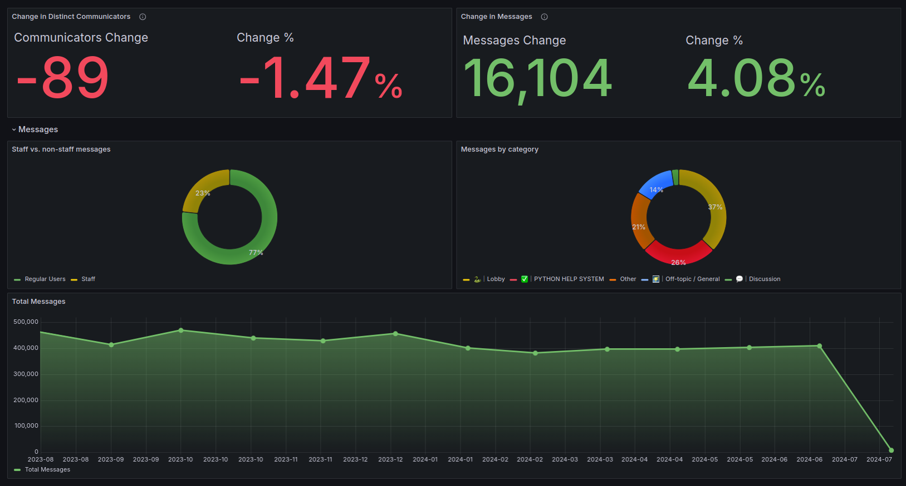
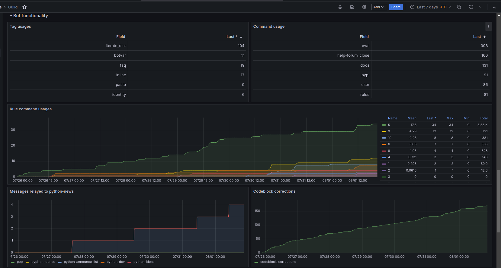
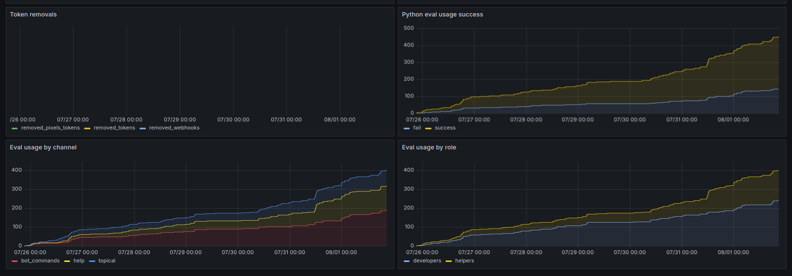
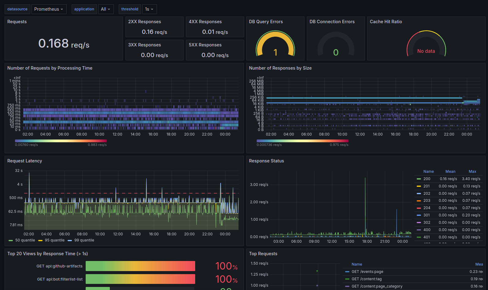
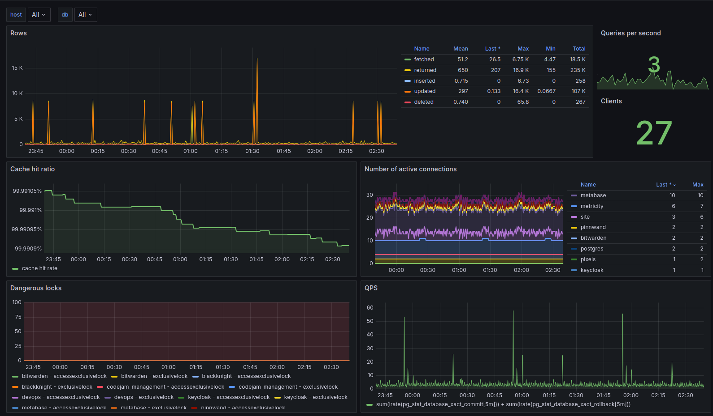
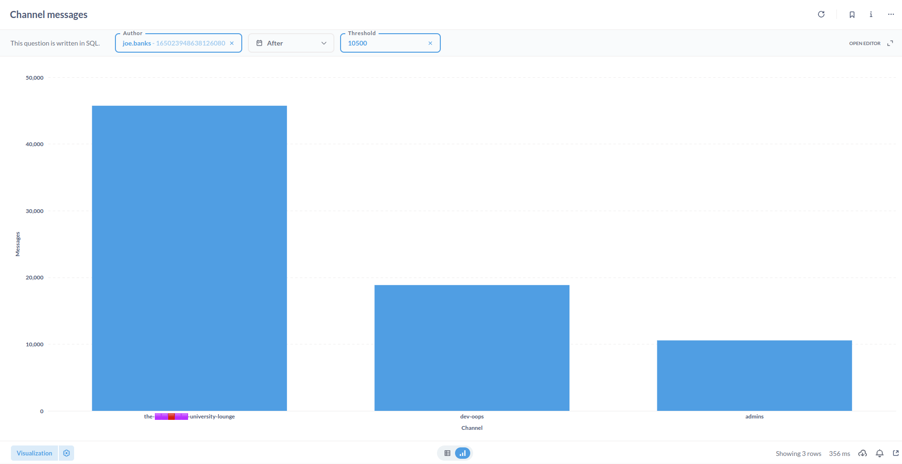

# Contents

# Introduction

In the [previous article](/posts/pydis-statistics-1-collection), we discussed the tools used to translate data generated by our community into a collectable format, including things like:
- Translating Discord interactions into privacy-friendly data
- Interactions with our Discord bot
- Collecting performance data from our site and API
- Using third-party exporter tools that export their own performance metrics

As a not-for-profit community we don't have the budget to store endless data, we have to know that the data we collect can be analysed and used to improve our community. This article will cover how we analyse the data we collect, and how we query it to draw conclusions.

I'm going to walkthrough how each category of data is queried and what sort of community-improving conclusions we can derive from that.

# Data Categories

## Discord Interactions: Metricity

By far the most useful data for us to develop our community is the data we collect from Discord interactions. This data is collected by our [Metricity](https://github.com/python-discord/metricity) bot, a project we built to collect privacy-friendly data from our Discord server.

This data is stored in PostgreSQL, an overview of the data format is given in [part 1 of this series](/posts/pydis-statistics-1-collection#detailed-collection-metricity).

To query this data, we primarily use [Grafana](https://grafana.com/) and [Metabase](https://www.metabase.com/).

Both of these tools are incredibly valuable to us as a community as they open up data analysis to none technical users, our administrator team can drill down on data without needing to write any SQL (though for more advanced questions raw SQL can be used).

From Metricity we can answer a heap of questions, in ascending order of "complexity":
- How many messages in a channel
- How many distinct users are using a channel
- How many help threads are created, and the average time to resolution
- How many help channels receive a message from a non-author (i.e. are people interacting with help threads)
- How many users are active by hour of day
- Of recently joined users, do any exhibit unusual behaviour (e.g. spamming)

There are a heap more bespoke and anti-spam related queries that we can derive from this data. Storing it in a relational database allows us to find new ways to ask questions of the same data down the line, something that isn't always possible with time-series data (e.g. gauges).

A particularly useful feature of Metricity is that we are able to tag message data onto existing data or business-side data, as an example:
- Python Discord appoints new people to the staff team via a nomination system, in which existing staff members nominate a candidate.
- Candidates are voted on for their roles by Moderators who perform a review of the candidate's interactions in the community.
- Using Metricity, we can enhance information available by Moderators by displaying channels that a given nominee frequents, aiding them in their review.



Our Administrator team also make larger decisions based on overall engagement with the community, which Metricity can help with.

We perform a selection of queries to generate user engagement Stats, but as an overview of the dashboard:



Data from Metricity has helped us keep our selection of topical channels up to date, source new members of our staff team, and keep our community safe from spam.

## Discord Bot Interactions: Graphite

As covered in [part 1](/posts/pydis-statistics-1-collection#quick--dirty-analytics-statsd--graphite), we collect information from our [Discord bot](https://github.com/python-discord/bot) which details how users interact with different features we've built, such as code evaluations and tag recall[^1].

This data is useful for similar purposes as Metricity, but is more focused on user experience of using our bot and which features we should focus on improving.

Data is stored in Graphite as time-series data, and we query it using Grafana. Examples of time-series data could be the following:

```
# A counter type metric, showing how many times a command was run
stats.bot.commands.ban +1
# A gauge type metric, showing how many users are in the guild
stats.gauges.bot.guild.total_members 389840
```

The important thing to note here is that the collected data is as appears above, there is no metadata, no additional information about the event (e.g. user, channel), just that the event happened.

This is simple by design, we don't often need to know much regarding the metadata of event invocations, we are simply looking at aggregations on the whole of how features are used.

Using this data, we can answer questions like:
- What are our top 20 most used commands
- How many help channels have been opened and closed and the timing between those events
- How many times has a specific tag been requested
- Using our `!doc` command (which fetches documentation items from popular Python packages), which packages are requested the most

As with Metricity, there are dozens of other bespoke cases for how we can process data collected here into actionable metrics.

As demonstrated in the previous article, it is incredibly easy to add these drop-in style statistics anywhere in our bot.





[^1]: Tags are predefined segments of text explaining common Python concepts (e.g. what `if __name__ == "__main__":` means), which users can have our bot relay into a channel to answer a FAQ.

## Site and API Performance: Prometheus

Again as covered in part 1 of the series, we use the fantastic `django-prometheus` package to collect performance data from our site and API.

Prometheus scrapes directly from the site to capture metrics such as:
- How many requests are being made to the site (and their method)
- Response times for requests (categorised by endpoint)
- Statistics on database query times
- Statistics on cache hit rates
- Statistics on number of database connections spawned

All of this we can query using Grafana to monitor the overall performance of our API. We can also use this data in alerting (covered in a later blog post) to alert for any unexpected performance issues, we can do this granularly by endpoint or globally.



I can't try to take credit for the specific dashboard used here, which was a community one made available [here](https://grafana.com/grafana/dashboards/17658-django/) on the Grafana dashboard repository.

## Third-Party exporters

We use a selection of other third-party exporters which export performance metrics about other components of our stack, these are listed [here](/posts/pydis-statistics-1-collection#third-party-services).

Similar to the Django exporter, these allow us to capture performance data and other facts about our stack and query them in a centralised location, both for observability and alerting.

Most of these exporters again use community provided dashboards which we have configured to our needs.



All the data collected by these exporters and presented in these graphs is hooked into our alerting system, which will be covered in a later blog post.

The data presented here is particularly useful in post-mortem analysis, you can find a post-mortem we performed a while ago [here](https://docs.pydis.wtf/post-mortems/2021/01/12/django-site-cpuram-exhaustion-outage.html), which was performed using data collected from these exporters.

# Metabase

Whilst not a direct part of the DevOps stack for infrastructure monitoring, a lot of non-technical members of staff use Metabase to query data from Metricity and our site API.

This data allows users to create queries with a visual builder without touching any SQL, and present it in a variety of ways (e.g. tables, graphs, etc).

This is used for event management, anti-spam, and community engagement queries.

We can also prepare questions in SQL for non-technical users to fill in with variables, allowing them to perform more complex queries without needing to know SQL.



# Conclusion

Hopefully this article provides a little overview of the kind of data we collect, visualise, and the kinds of conclusions we can draw from it.

Trying to convert a Discord community into actionable metrics, especially whilst preserving privacy, is a difficult task, but one that is incredibly rewarding when you can numerically measure the impact of changes you make.

In the subsequent articles, we'll cover how we take this data and write alerts on it, for both the Discord and service side of our stack.
